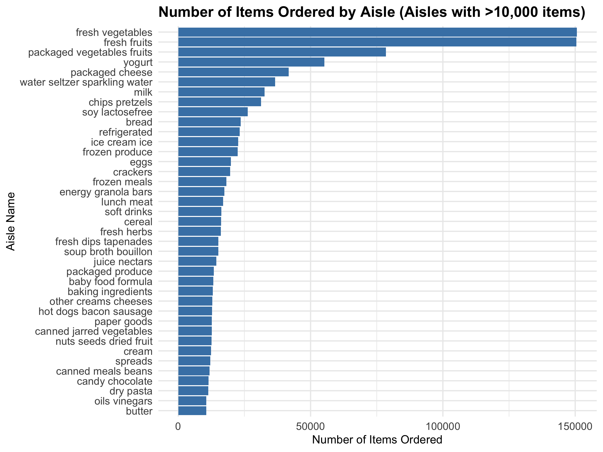

p8105_hw2_xz3499
================
Xintong Zhao
2025-10-3

## Set the knitr option

``` r
knitr::opts_chunk$set(
  echo = TRUE,           
  warning = FALSE,       
  message = FALSE, 
  fig.width = 8,         
  fig.height = 6,        
  fig.align = "center",  
  out.width = "90%",     
  dpi = 300              
)
```

## Load required libraries

``` r
library(tidyverse)      
library(p8105.datasets) 
library(knitr)          
library(patchwork)      
library(lubridate)      
library(ggthemes) 
```

## Set a unified image format and theme

``` r
theme_set(theme_minimal(base_size = 12) + 
            theme(plot.title = element_text(size = 14, face = "bold"),
                  plot.subtitle = element_text(size = 12),
                  axis.title = element_text(size = 11),
                  axis.text = element_text(size = 10),
                  legend.title = element_text(size = 11),
                  legend.text = element_text(size = 10)))
```

## Problem 1

### 1. Load the dataset

``` r
data("instacart")
```

### A discription of the dataset

``` r
glimpse(instacart)
```

    ## Rows: 1,384,617
    ## Columns: 15
    ## $ order_id               <int> 1, 1, 1, 1, 1, 1, 1, 1, 36, 36, 36, 36, 36, 36,…
    ## $ product_id             <int> 49302, 11109, 10246, 49683, 43633, 13176, 47209…
    ## $ add_to_cart_order      <int> 1, 2, 3, 4, 5, 6, 7, 8, 1, 2, 3, 4, 5, 6, 7, 8,…
    ## $ reordered              <int> 1, 1, 0, 0, 1, 0, 0, 1, 0, 1, 0, 1, 1, 1, 1, 1,…
    ## $ user_id                <int> 112108, 112108, 112108, 112108, 112108, 112108,…
    ## $ eval_set               <chr> "train", "train", "train", "train", "train", "t…
    ## $ order_number           <int> 4, 4, 4, 4, 4, 4, 4, 4, 23, 23, 23, 23, 23, 23,…
    ## $ order_dow              <int> 4, 4, 4, 4, 4, 4, 4, 4, 6, 6, 6, 6, 6, 6, 6, 6,…
    ## $ order_hour_of_day      <int> 10, 10, 10, 10, 10, 10, 10, 10, 18, 18, 18, 18,…
    ## $ days_since_prior_order <int> 9, 9, 9, 9, 9, 9, 9, 9, 30, 30, 30, 30, 30, 30,…
    ## $ product_name           <chr> "Bulgarian Yogurt", "Organic 4% Milk Fat Whole …
    ## $ aisle_id               <int> 120, 108, 83, 83, 95, 24, 24, 21, 2, 115, 53, 1…
    ## $ department_id          <int> 16, 16, 4, 4, 15, 4, 4, 16, 16, 7, 16, 4, 16, 2…
    ## $ aisle                  <chr> "yogurt", "other creams cheeses", "fresh vegeta…
    ## $ department             <chr> "dairy eggs", "dairy eggs", "produce", "produce…

``` r
view(instacart)
```

- Size and Structure:

  - The Instacart dataset contains 1384617 observations of 15 variables,
    representing individual grocery items ordered through the Instacart
    service. The dataset is structured with each row representing one
    item within an order, and includes 131209 independent orders, 131209
    different users, and 39123 different products.

- Key variables:

  - The dataset includes some basic information such as order
    identification (`order_id`), product information (`product_id`,
    `product_name`), categorical organization (`aisle_id`, `aisle`,
    `department_id`, `department`), and user identification (`user_id`).

  - Product classification system: All the products are organized in 134
    aisles under 21 departments.

  - Repurchase behavior: Product with 59.9% are considered repurchase
    behavior, indicating that the user has a certain degree of brand or
    product loyalty.

  - Shopping cart order: The `add_to_cart_order` records the order in
    which goods are added to the shopping cart, reflecting the user’s
    shopping decision-making process.

  - Time pattern: The dataset contains which day of the
    week(`order_dow`) and which hour of the day(`order_hour_of_day`)
    orders are placed, as well as the number of days since the last
    order was placed(`days_since_prior_order`), which can be used to
    analyze shopping time references.

- Illstrative examples:

  - Bulgarian Yogurt(located in yogurt aisle）

  - Geranium Liquid Dish Soap (belonging to household department）

  - Brown Rice (Added to the shopping cart as the 8 in the order)

1.  How many aisles are there, and which aisles are the most items
    ordered from?

The dataset contains 134 distinct aisles. The top three aisles with the
most items ordered are: fresh vegetables(with 150609 items ordered),
fresh fruits (150473 items), and packaged vegetables fruits (78493
items).

2.  A plot that shows the number of items ordered in each aisle:

``` r
instacart %>%
  count(aisle) %>%
  filter(n > 10000) %>%
  mutate(aisle = fct_reorder(aisle, n)) %>%
  ggplot(aes(x = n, y = aisle)) +
  geom_col(fill = "steelblue") +
  labs(
    title = "Number of Items Ordered by Aisle (Aisles with >10,000 items)",
    x = "Number of Items Ordered",
    y = "Aisle Name"
  )
```



3.  A table showing the three most popular items:
