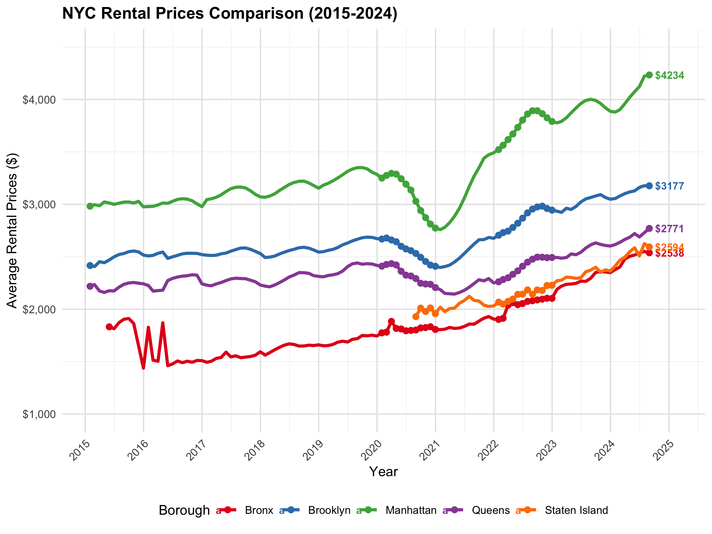
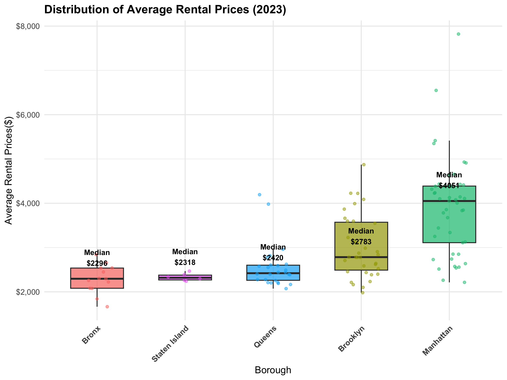
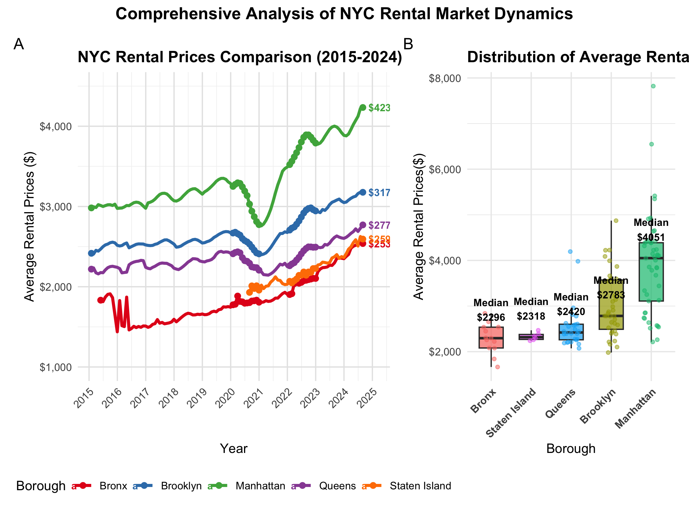

p8105_hw2_xz3499
================
Xintong Zhao
2025-10-3

## Set the knitr option

``` r
knitr::opts_chunk$set(
  echo = TRUE,           
  warning = FALSE,       
  message = FALSE, 
  fig.width = 8,         
  fig.height = 6,        
  fig.align = "center",  
  out.width = "90%",     
  dpi = 300              
)
```

## Load required libraries

``` r
library(tidyverse)      
library(p8105.datasets) 
library(knitr)          
library(patchwork)      
library(lubridate)      
library(ggthemes)
library(kableExtra)
```

## Set a unified image format and theme

``` r
theme_set(theme_minimal(base_size = 12) + 
            theme(plot.title = element_text(size = 14, face = "bold"),
                  plot.subtitle = element_text(size = 12),
                  axis.title = element_text(size = 11),
                  axis.text = element_text(size = 10),
                  legend.title = element_text(size = 11),
                  legend.text = element_text(size = 10)))
```

## Problem 1

### 1. Load the dataset

``` r
data("instacart")
```

### 2. A discription of the dataset

``` r
glimpse(instacart)
```

    ## Rows: 1,384,617
    ## Columns: 15
    ## $ order_id               <int> 1, 1, 1, 1, 1, 1, 1, 1, 36, 36, 36, 36, 36, 36,…
    ## $ product_id             <int> 49302, 11109, 10246, 49683, 43633, 13176, 47209…
    ## $ add_to_cart_order      <int> 1, 2, 3, 4, 5, 6, 7, 8, 1, 2, 3, 4, 5, 6, 7, 8,…
    ## $ reordered              <int> 1, 1, 0, 0, 1, 0, 0, 1, 0, 1, 0, 1, 1, 1, 1, 1,…
    ## $ user_id                <int> 112108, 112108, 112108, 112108, 112108, 112108,…
    ## $ eval_set               <chr> "train", "train", "train", "train", "train", "t…
    ## $ order_number           <int> 4, 4, 4, 4, 4, 4, 4, 4, 23, 23, 23, 23, 23, 23,…
    ## $ order_dow              <int> 4, 4, 4, 4, 4, 4, 4, 4, 6, 6, 6, 6, 6, 6, 6, 6,…
    ## $ order_hour_of_day      <int> 10, 10, 10, 10, 10, 10, 10, 10, 18, 18, 18, 18,…
    ## $ days_since_prior_order <int> 9, 9, 9, 9, 9, 9, 9, 9, 30, 30, 30, 30, 30, 30,…
    ## $ product_name           <chr> "Bulgarian Yogurt", "Organic 4% Milk Fat Whole …
    ## $ aisle_id               <int> 120, 108, 83, 83, 95, 24, 24, 21, 2, 115, 53, 1…
    ## $ department_id          <int> 16, 16, 4, 4, 15, 4, 4, 16, 16, 7, 16, 4, 16, 2…
    ## $ aisle                  <chr> "yogurt", "other creams cheeses", "fresh vegeta…
    ## $ department             <chr> "dairy eggs", "dairy eggs", "produce", "produce…

``` r
view(instacart)
```

- Size and Structure:

  - The Instacart dataset contains 1384617 observations of 15 variables,
    representing individual grocery items ordered through the Instacart
    service. The dataset is structured with each row representing one
    item within an order, and includes 131209 independent orders, 131209
    different users, and 39123 different products.

- Key variables:

  - The dataset includes some basic information such as order
    identification (`order_id`), product information (`product_id`,
    `product_name`), categorical organization (`aisle_id`, `aisle`,
    `department_id`, `department`), and user identification (`user_id`).

  - Product classification system: All the products are organized in 134
    aisles under 21 departments.

  - Repurchase behavior: Product with 59.9% are considered repurchase
    behavior, indicating that the user has a certain degree of brand or
    product loyalty.

  - Shopping cart order: The `add_to_cart_order` records the order in
    which goods are added to the shopping cart, reflecting the user’s
    shopping decision-making process.

  - Time pattern: The dataset contains which day of the
    week(`order_dow`) and which hour of the day(`order_hour_of_day`)
    orders are placed, as well as the number of days since the last
    order was placed(`days_since_prior_order`), which can be used to
    analyze shopping time references.

- Illstrative examples:

  - Bulgarian Yogurt(located in yogurt aisle）

  - Geranium Liquid Dish Soap (belonging to household department）

  - Brown Rice (Added to the shopping cart as the 8 in the order)

3.  How many aisles are there, and which aisles are the most items
    ordered from?

The dataset contains 134 distinct aisles. The top three aisles with the
most items ordered are: fresh vegetables(with 150609 items ordered),
fresh fruits (150473 items), and packaged vegetables fruits (78493
items).

4.  A plot that shows the number of items ordered in each aisle:

``` r
instacart %>%
  count(aisle) %>%
  filter(n > 10000) %>%
  mutate(aisle = fct_reorder(aisle, n)) %>%
  ggplot(aes(x = n, y = aisle)) +
  geom_col(fill = "steelblue") +
  labs(
    title = "Number of Items Ordered by Aisle (Aisles with >10,000 items)",
    x = "Number of Items Ordered",
    y = "Aisle Name"
  )
```


5.  A table showing the three most popular items:

``` r
target_aisles <- c("baking ingredients", "dog food care", "packaged vegetables fruits")

most_popular_items <- instacart %>%
  filter(aisle %in% target_aisles) %>%
  # Group by aisle and product to count orders per product
  group_by(aisle, product_name) %>%
  summarize(n_ordered = n(), .groups = "drop") %>%
  group_by(aisle) %>%
  slice_max(n_ordered, n = 3) %>%
  arrange(aisle, desc(n_ordered))

most_popular_items %>% 
  kable(caption = "Top Three Most Popular Items in Specified Aisles") 
```

| aisle | product_name | n_ordered |
|:---|:---|---:|
| baking ingredients | Light Brown Sugar | 499 |
| baking ingredients | Pure Baking Soda | 387 |
| baking ingredients | Cane Sugar | 336 |
| dog food care | Snack Sticks Chicken & Rice Recipe Dog Treats | 30 |
| dog food care | Organix Chicken & Brown Rice Recipe | 28 |
| dog food care | Small Dog Biscuits | 26 |
| packaged vegetables fruits | Organic Baby Spinach | 9784 |
| packaged vegetables fruits | Organic Raspberries | 5546 |
| packaged vegetables fruits | Organic Blueberries | 4966 |

Top Three Most Popular Items in Specified Aisles

6.  A table showing the mean hour of the day

``` r
mean_hour <- instacart %>%
  filter(product_name %in% c("Pink Lady Apples", "Coffee Ice Cream")) %>%
  group_by(product_name, order_dow) %>%
  summarize(mean_hour = round(mean(order_hour_of_day), 2), .groups = "drop") %>%
  pivot_wider(
    names_from = order_dow,
    values_from = mean_hour
  )

# Add meaningful column names
colnames(mean_hour) <- c("Product Name", "Sunday", "Monday", "Tuesday", "Wednesday", "Thursday", "Friday", "Saturday")

mean_hour %>% 
  kable(caption = "Average Order Hour (24-hour format) for Pink Lady Apples and Coffee Ice Cream by Day of Week") 
```

| Product Name     | Sunday | Monday | Tuesday | Wednesday | Thursday | Friday | Saturday |
|:-----------------|-------:|-------:|--------:|----------:|---------:|-------:|---------:|
| Coffee Ice Cream |  13.77 |  14.32 |   15.38 |     15.32 |    15.22 |  12.26 |    13.83 |
| Pink Lady Apples |  13.44 |  11.36 |   11.70 |     14.25 |    11.55 |  12.78 |    11.94 |

Average Order Hour (24-hour format) for Pink Lady Apples and Coffee Ice
Cream by Day of Week

## Problem 2

### 1. Load and tidy the datasets

``` r
zip <- read_csv("zillow_data/Zip Codes.csv") %>% 
  janitor::clean_names()

view(zip)

#Create a borough mapping table
borough_mapping <- data.frame(
  county = c("New York", "Kings", "Queens", "Bronx", "Richmond"),
  borough = c("Manhattan", "Brooklyn", "Queens", "Bronx", "Staten Island")
)

zori <- read_csv("zillow_data/Zip_zori_uc_sfrcondomfr_sm_month_NYC.csv") %>% 
  janitor::clean_names() %>% 
  rename(zip_code = region_name) %>% 
  pivot_longer(
    cols = matches("^x\\d{4}_\\d{2}_\\d{2}$"),
    names_to = "date",
    values_to = "zori"
  ) %>%
  mutate(date = str_remove(date, "^x") %>% 
         str_replace_all("_", "-") %>% 
         ymd())

view(zori)

zillow_data <- zori %>% 
  left_join(
    zip,
    by = "zip_code",
    relationship = "many-to-many"
  ) %>% 
  left_join(borough_mapping, by = "county") %>% 
  select(-county_name)

view(zillow_data)
```

### 2. ZIP code observation frequency

``` r
# The total number of distinct months
total_months <- zillow_data %>% 
  filter(!is.na(zori)) %>%
  distinct(date) %>% 
  nrow()

# Observation frequency per ZIP cod
zip_obs_freq <- zillow_data %>%
  filter(!is.na(zori)) %>%
  distinct(zip_code, date) %>%
  count(zip_code, name = "n_observations")

# ZIP codes with 116 observations 
obs_full <- zip_obs_freq %>% 
  filter(n_observations == total_months) %>% 
  nrow()

# ZIP codes with fewer than 10 observations
obs_few <- zip_obs_freq %>% 
  filter(n_observations < 10) %>% 
  nrow()

# Calculate percentage coverage
total_zips <- n_distinct(zip_obs_freq$zip_code)
pct_obs_full <- round(obs_full / total_zips * 100, 1)
pct_obs_few <- round(obs_few / total_zips * 100, 1)
```

- The ZIP code observed 116 times : 48 ( 32.2 %)

- ZIP code for observations less than 10 times: 26 ( 17.4 %)

- The reason of some ZIP codes are observed rarely and others observed
  in each month:

  - Percentile range: Only the listed rent within the 35th to 65th
    percentile range is calculated. This may affect the observation
    frequency in some extreme market areas.

  - Market Activity: Postal codes with more active rental markets are
    more likely to have complete data, while regions with limited rental
    activities may have sparse observations.

  - Geographical changes: The boundaries of postal codes may have
    changed over time, or new postal codes may have been created during
    the research period.

  - Housing Stock characteristics: In regions where self-owned housing
    is dominant or rental inventory is limited, there will naturally be
    fewer observations in the data set that focuses on rent.

### 3. Average rental price in each borough and year

``` r
borough_year_avg <- zillow_data %>%
  filter(!is.na(zori), !is.na(borough)) %>%
  mutate(year = year(date)) %>%
  group_by(borough, year) %>%
  summarize(
    avg_zori = round(mean(zori, na.rm = TRUE)),
    .groups = "drop"
  ) %>%
  arrange(borough, year)

borough_year_avg_table <- borough_year_avg %>%
  select(borough, year, avg_zori) %>%
  pivot_wider(
    names_from = year,
    values_from = avg_zori
  )

borough_year_avg_table %>%
  knitr::kable(
    format = "pipe",
    digits = 0
  )
```

| borough       | 2015 | 2016 | 2017 | 2018 | 2019 | 2020 | 2021 | 2022 | 2023 | 2024 |
|:--------------|-----:|-----:|-----:|-----:|-----:|-----:|-----:|-----:|-----:|-----:|
| Bronx         | 1760 | 1520 | 1544 | 1639 | 1706 | 1811 | 1858 | 2054 | 2285 | 2497 |
| Brooklyn      | 2493 | 2520 | 2546 | 2547 | 2631 | 2555 | 2550 | 2868 | 3015 | 3126 |
| Manhattan     | 3006 | 3015 | 3109 | 3160 | 3285 | 3091 | 3124 | 3753 | 3908 | 4053 |
| Queens        | 2215 | 2272 | 2263 | 2292 | 2388 | 2316 | 2211 | 2406 | 2562 | 2694 |
| Staten Island |   NA |   NA |   NA |   NA |   NA | 1978 | 2045 | 2147 | 2333 | 2536 |

- From 2015 to 2024, the rental market in New York City has shown a
  strong growth trend, with an average increase of approximately 31%。

- Manhattan increased from \$3006 to \$4053, representing a growth of
  34.8%, with a pandemic-related decline to \$3091 in 2020 followed by a
  strong rebound to \$3753 in 2022; Brooklyn rose steadily from \$2493
  to \$3126, growing by 25.4%; Queens increased from \$2215 to \$2694,
  up 21.6%, experiencing a significant correction in 2021 with
  relatively moderate but sustained post-pandemic recovery; The Bronx
  showed the largest gain, surging from \$1760 to \$2497, up 41.9%,
  without any decline even in 2020; Staten Island, with records
  beginning only in 2019, rose from \$1978 to \$2536 , growing by 28.2%.

### 4. NYC rental prices with ZIP codes

``` r
rent_comparison <- zillow_data %>%
  filter(!is.na(zori), !is.na(borough)) %>%
  # Calculate borough-level monthly averages for cleaner comparison
  group_by(borough, date) %>%
  summarize(
    borough_zori = mean(zori, na.rm = TRUE),
    .groups = "drop"
  ) %>%
  ggplot(aes(x = date, y = borough_zori, color = borough)) +
  geom_line(linewidth = 1.2) +
  geom_point(data = . %>% 
              group_by(borough) %>% 
  # Mark the starting and ending points of time
              filter(date == max(date) | date == min(date) |
  # Mark the pandemic year and the recovery year in particular
                     year(date) %in% c(2020, 2022)), 
            size = 2) +
  # Display the current rental value at the end of time in each boroughs
  geom_text(data = . %>% 
              group_by(borough) %>% 
              filter(date == max(date)), 
            aes(label = paste0("$", round(borough_zori))),
            hjust = -0.2, size = 3, fontface = "bold") +
  labs(
    title = "NYC Rental Prices Comparison (2015-2024)",
    x = "Year",
    y = "Average Rental Prices ($)",
    color = "Borough"
  ) +
  scale_y_continuous(
    labels = scales::dollar_format(),
    limits = c(1000, 4500) 
  ) +
  scale_x_date(
    date_breaks = "1 year", 
    date_labels = "%Y",
    expand = expansion(mult = c(0.05, 0.1)) 
  ) +
  scale_color_brewer(palette = "Set1") +
  theme_minimal() +
  theme(
    legend.position = "bottom",
    axis.text.x = element_text(angle = 45, hjust = 1),
    plot.title = element_text(face = "bold"),
    panel.grid.major = element_line(color = "grey90"),
    panel.grid.minor = element_line(color = "grey95")
  )

rent_comparison
```



As shown in the figure, all boroughs have shown an overall upward trend.
Obvious price fluctuations can be seen around 2020, and prices have
gradually rebounded in the post-pandemic period. The relative positions
among the various boroughs remained stable throughout the period.
Manhattan is at the top of the picture, indicating its highest rental
level, while Staten Island is at the bottom, with a significant gap
between the two.

### 5. Average rental price within each ZIP code over each month in 2023

``` r
zip_level_data <- zillow_data %>%
  filter(year(date) == 2023, !is.na(zori), !is.na(borough)) %>%
  group_by(zip_code, borough) %>%
  summarize(
    avg_rent_2023 = mean(zori, na.rm = TRUE),
    n_months = n(),
    .groups = "drop"
  ) %>%
  filter(n_months >= 6)

borough_stats <- zip_level_data %>%
  group_by(borough) %>%
  summarize(
    median_rent = median(avg_rent_2023),
    mean_rent = mean(avg_rent_2023),
    q1 = quantile(avg_rent_2023, 0.25),
    q3 = quantile(avg_rent_2023, 0.75),
    n_zipcodes = n(),
    .groups = "drop"
  )

dist_comparison_2023 <- zip_level_data %>%  
  ggplot(aes(x = fct_reorder(borough, avg_rent_2023, .fun = median), 
             y = avg_rent_2023, 
             fill = borough)) +
  geom_boxplot(alpha = 0.7, outlier.shape = NA, width = 0.6) +
  geom_jitter(width = 0.2, alpha = 0.5, size = 1.2, aes(color = borough)) +
  geom_text(
    data = borough_stats,  
    aes(x = borough, y = median_rent, 
        label = paste0("Median\n$", round(median_rent))),
    vjust = -0.8, size = 3, fontface = "bold"
  ) +
  labs(
    title = "Distribution of Average Rental Prices (2023)",
    x = "Borough",
    y = "Average Rental Prices($)",
    fill = "Borough",
    color = "Borough"
  ) +
  scale_y_continuous(labels = scales::dollar_format()) +
  theme_minimal() +
  theme(
    axis.text.x = element_text(angle = 45, hjust = 1, face = "bold"),
    legend.position = "none",
    plot.title = element_text(face = "bold")
  )

dist_comparison_2023
```



The rents in various boroughs of New York show a clear hierarchical
structure: Manhattan is at the top of the map, with the widest
distribution and a significant right bias. Brooklyn and Queens form the
mid-range market, with Queens having a relatively concentrated
distribution. Staten Island and the Bronx form a relatively affordable
housing market, with Staten Island having a more compact distribution.

### 6. Combine the two plots

``` r
combined_plot <- rent_comparison + dist_comparison_2023 +
  plot_annotation(
    title = "Comprehensive Analysis of NYC Rental Market Dynamics",
    tag_levels = 'A',
    theme = theme(
      plot.title = element_text(face = "bold", size = 14, hjust = 0.5)
    )
  ) +
  plot_layout(widths = c(1.5, 1)) 

combined_plot
```



``` r
ggsave(
  "results/nyc_rental_prices_comprehensive_analysis.png",
  combined_plot,
  width = 16,
  height = 8, 
  dpi = 300,
  bg = "white"
)
```
